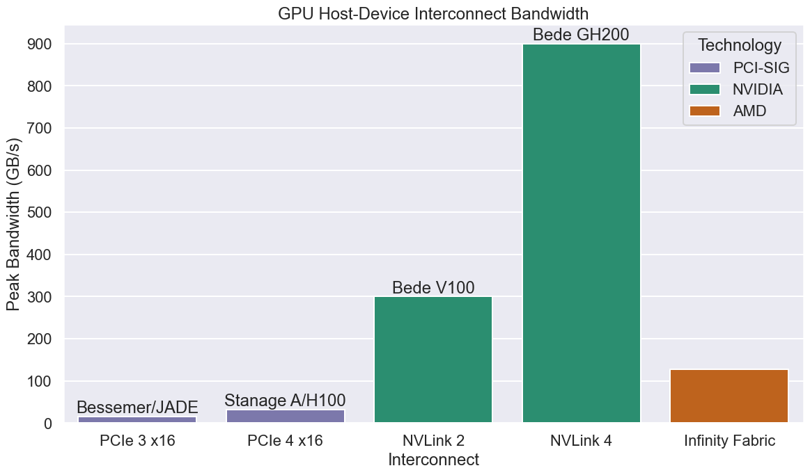

# GPU Interconnect plots

Plots/Data for the GPU specs plots for use in presentations.



## Requirements

+ `python3` with `pip` to install other dependencies (and `venv`)
  + See `requirements.txt` for python packages required

## Installing dependencies (venv)

```bash
python3 -m venv .venv
source .venv/bin/activate
python3 -m pip install -r requirements.txt
```

## Usage

With the appropriate python environment activated

```bash
source .venv/bin/activate
```

```console
$ ./plot.py --help
usage: plot.py [-h] -i INPUT [-o OUTPUT] [-f] [--title TITLE] [--bar-label BAR_LABEL]

options:
  -h, --help            show this help message and exit
  -i INPUT, --input INPUT
                        input csv path
  -o OUTPUT, --output OUTPUT
                        output image path. shows if omitted
  -f, --force           Overwrite existing output files
  --title TITLE         Figure title
  --bar-label BAR_LABEL
                        CSV column to use for the bar label
```

## Examples

The images committed to this repo were created via: 

```bash
source .venv/bin/activate
./plot.py -i data/interconnects.csv -o png/interconnects.png -f
./plot.py -i data/interconnects-used.csv -o png/interconnects-used.png -f
./plot.py -i data/interconnects-subset.csv -o png/interconnects-subset.png -f
./plot.py -i data/interconnects-tuos.csv -o png/interconnects-tuos.png -f --bar-label example
```

## License

The content of this project itself is licensed under the [Creative Commons Attribution 4.0 license](https://creativecommons.org/licenses/by/4.0/), and the underlying source code used to format and display that content is licensed under the [MIT license](LICENSE.md).
